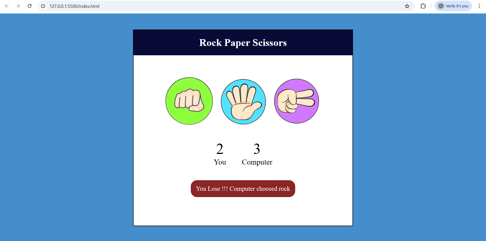

# ✊✋✌️ Rock Paper Scissors Game

This is a simple and fun **Rock Paper Scissors** game built using **HTML**, **CSS**, and **JavaScript**. The user plays against the computer, and the winner is decided based on standard game rules.

🔗 **Live Demo**: [Play Now](https://suhani-01.github.io/RockPaperScissors/)

---

## 🎮 Features

- Interactive gameplay
- Random computer choice
- Score tracking
- Instant win/draw/loss result display
- Simple and responsive UI

---

## 🛠️ Technologies Used

- HTML5
- CSS3
- JavaScript (Vanilla)

---

